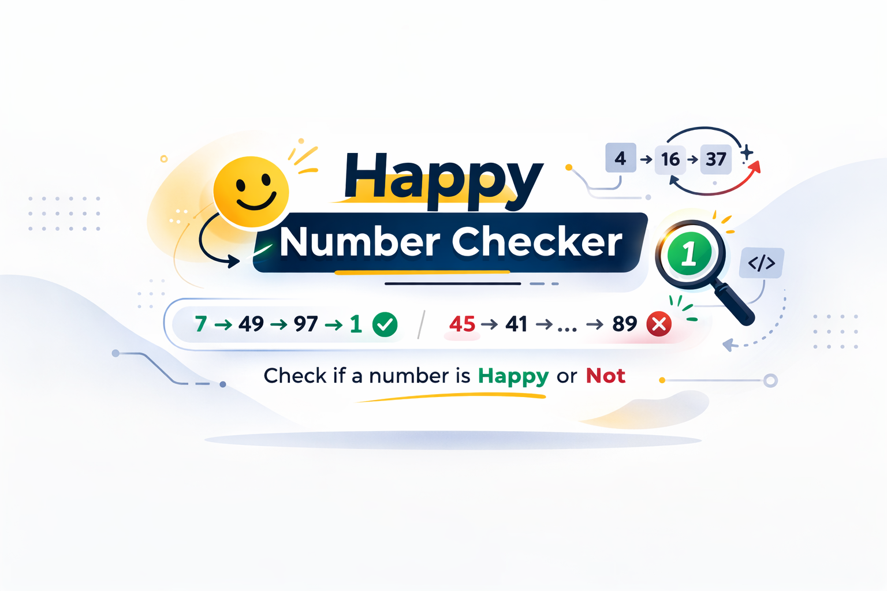

  


# Happy Number Checker
This project provides a simple Python implementation to determine whether a number is a happy number.


## What Is a Happy Number?
A number that eventually reaches 1 when replaced repeatedly by the __sum of the squares of its digits__.  
If the process enters a loop that does not include `1`, then the number is not happy.

### Examples:
`7 → 49 → 97 → 130 → 10 → 1` __: Happy__  
`45 → 41 → 17 → 50 → 25 → 29 → 85 → 89 → ...` __: (Loops, not happy)__


## How It Works
The algorithm:
1. Stores previously seen numbers in a set.
2. Replaces the number with the sum of the squares of its digits.
3. Repeats until:
    - The number becomes 1 → Happy number
    - A previously seen number appears → Cycle detected (Not happy)


## How to Run
1. Save the file as `happy_number.py`
2. Run:
```
python happy_number.py
```
If no output appears, all assertions passed successfully